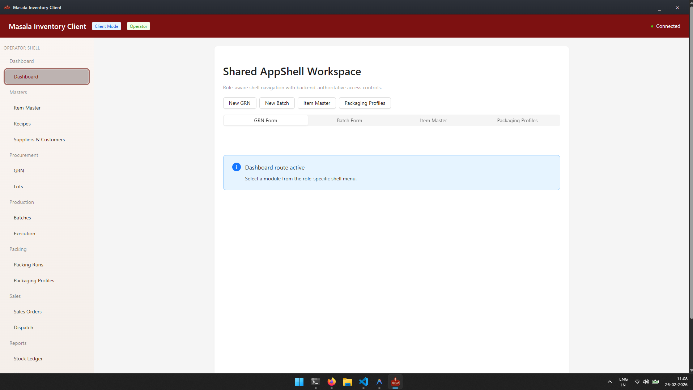

# Masala Inventory Manager

A cross-platform desktop inventory management application for spice businesses, built with Go and React.



---

## Tech Stack

| Layer | Technology |
|---|---|
| Desktop runtime | [Wails v2](https://wails.io) (Go + WebView) |
| Backend | Go 1.26, SQLite (via go-sqlite3), golang-migrate |
| Auth | JWT (golang-jwt/jwt v5) |
| Frontend | React 19, TypeScript, Vite |
| UI | Ant Design 6, TanStack React Query, React Router v6 |
| Testing | Vitest, Testing Library |
| System tray | getlantern/systray |

---

## Features

- Inventory tracking for products and stock levels
- JWT-based authentication with secure session management
- Client-server architecture within a single desktop app
- System tray integration for background operation
- SQLite database with migration support
- React Query for server state management

---

## Project Structure

```
├── cmd/              # Go entry points
├── internal/
│   ├── app/          # Application layer
│   ├── domain/       # Business logic and entities
│   └── infrastructure/ # DB, auth, external services
├── frontend/         # React + TypeScript UI
│   └── src/
├── Screenshots/      # App screenshots
└── wails.json        # Wails config
```

---

## Getting Started

### Prerequisites

- [Go 1.21+](https://go.dev/dl/)
- [Node.js 18+](https://nodejs.org/)
- [Wails CLI](https://wails.io/docs/gettingstarted/installation): `go install github.com/wailsapp/wails/v2/cmd/wails@latest`

### Run in development

```bash
wails dev
```

### Build

```bash
wails build
```

Produces a native executable in `build/bin/`.

---

## Screenshots

### Dashboard

